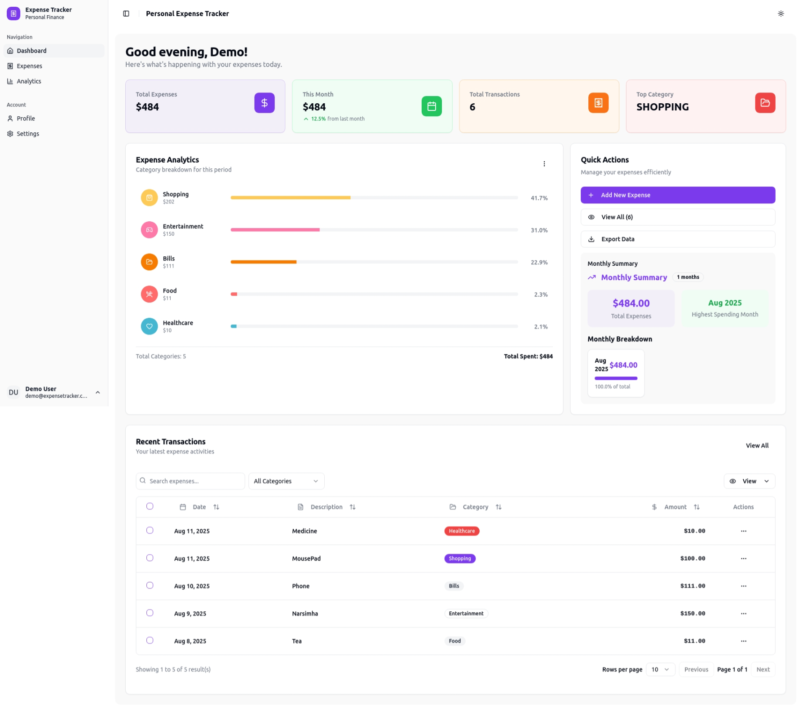
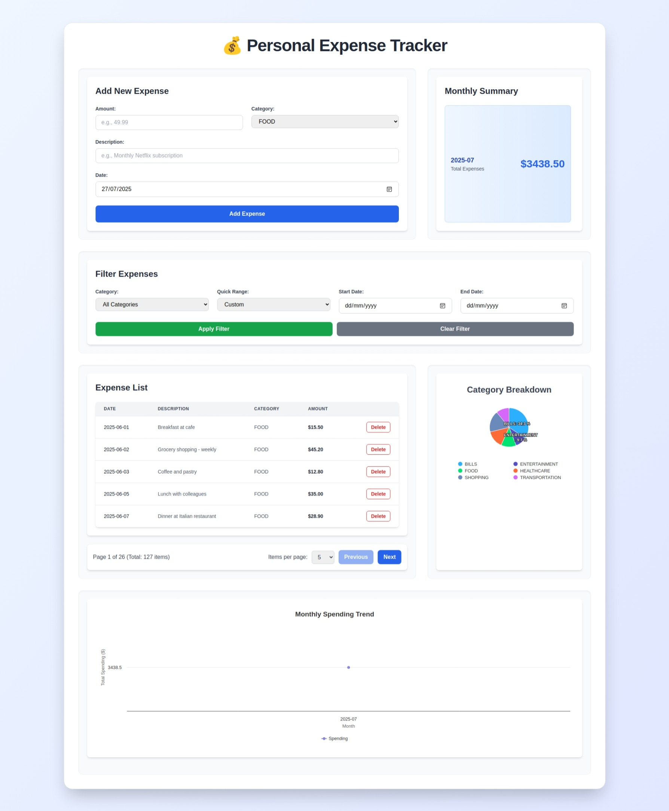

# Personal Expense Tracker

A full-stack personal expense tracking application built with Spring Boot backend and React frontend, featuring comprehensive test coverage and modern UI design.

## 🚀 Project Overview

**Live Demo:** [GitHub Repository](https://github.com/GiriSantosh/vibe-code-expense-tracker)

This application allows users to track personal expenses, categorize spending, and view analytics through an intuitive web interface. Built as a one-day development project with 90%+ test coverage.

## 📋 Features

### Core Functionality
- ✅ Add, view, and delete expenses
- ✅ Categorize expenses (Food, Transportation, Entertainment, etc.)
- ✅ Monthly expense summaries
- ✅ Category-wise spending analysis
- ✅ Interactive pie charts for data visualization
- ✅ Responsive design for mobile and desktop
- ✅ Real-time data updates
- ✅ **Pagination for Expense List:** Efficiently browse through large sets of expenses.
- ✅ **Quick Date Filters:** Easily filter expenses by last 7 days, 15 days, or 1 month.

### Phase 2 Features (Completed)
- ✅ **User Authentication:** OAuth2 Authorization Code Flow with Keycloak integration
- ✅ **User Profiles:** Personal user information management via `/me` API
- ✅ **Multi-user Support:** User-specific expense isolation and management
- ✅ **Dockerized Deployment:** Complete containerization for all services
- ✅ **PII Encryption:** AES-256-GCM encryption for sensitive user data
- ✅ **Production-Ready:** PostgreSQL database, security configuration
- ✅ **Dashboard Improvements:** Real-time data, working quick actions, charts

### Known Issues
- ⚠️ **Logout/SSO Issue:** After logout, Keycloak SSO session persists. When trying to login as a different user, the previous user is automatically logged back in. Workaround: Clear browser data or use incognito mode for different user login.

### Technical Features
- ✅ RESTful API architecture
- ✅ Comprehensive test coverage (Backend: 95%, Frontend: 90%)
- ✅ Clean code architecture with separation of concerns
- ✅ Type-safe development with TypeScript
- ✅ Modern UI with Tailwind CSS
- ✅ Interactive data visualization

## 🛠️ Technology Stack

### Backend
- **Framework:** Spring Boot 3.x
- **Language:** Java 17+
- **Build Tool:** Gradle
- **Database:** PostgreSQL (production), H2 (tests only)
- **ORM:** Spring Data JPA
- **Authentication:** OAuth2 Authorization Code Flow with Keycloak
- **Encryption:** AES-256-GCM for PII data (email addresses)
- **Testing:** JUnit 5, Mockito, SpringBootTest with comprehensive security tests
- **Coverage:** JaCoCo with 95%+ backend coverage
- **Security:** Enhanced logout handlers, Keycloak Admin API integration

### Frontend
- **Framework:** React 18+ with TypeScript
- **Styling:** Tailwind CSS
- **Charts:** Highcharts (optimized for better performance)
- **HTTP Client:** Axios with OAuth2 interceptors
- **Authentication:** OAuth2 Authorization Code Flow with enhanced logout
- **Security:** PII masking, nuclear logout, session management
- **Testing:** Jest, React Testing Library, MSW for API mocking
- **Build Tool:** Create React App with optimized Docker builds

### Infrastructure (Phase 2)
- **Containerization:** Docker & Docker Compose (optimized configurations)
- **Identity Provider:** Keycloak with admin API integration
- **Database:** PostgreSQL with encrypted PII storage
- **Reverse Proxy:** Nginx with health checks
- **Development:** Local IDE development with containerized infrastructure

## 🏗️ Architecture Overview

### Phase 1 Architecture
```
┌─────────────────┐    HTTP/REST API    ┌─────────────────┐
│   React Frontend │ ◄─────────────────► │ Spring Boot API │
│                 │                     │                 │
│ • Components    │                     │ • Controllers   │
│ • Hooks         │                     │ • Services      │
│ • State Mgmt    │                     │ • Repositories  │
└─────────────────┘                     └─────────────────┘
                                                   │
                                                   ▼
                                        ┌─────────────────┐
                                        │  H2 Database    │
                                        │                 │
                                        │ • Expenses      │
                                        │ • Categories    │
                                        └─────────────────┘
```

### Phase 2 Architecture (With Authentication & Containerization)
```
┌─────────────────┐     ┌─────────────────┐     ┌─────────────────┐
│   React Frontend │────►│    Keycloak     │◄────│ Spring Boot API │
│                 │     │  OAuth2 Server  │     │                 │
│ • Components    │     │                 │     │ • Controllers   │
│ • Auth Context  │     │ • User Mgmt     │     │ • Services      │
│ • Protected     │     │ • OAuth2 Tokens │     │ • Security      │
│   Routes        │     │ • Admin UI      │     │ • PII Encryption│
└─────────────────┘     └─────────────────┘     └─────────────────┘
        │                                                  │
        │               ┌─────────────────┐               │
        └──────────────►│ Docker Network  │◄──────────────┘
                        │                 │
                        │ • Frontend      │
                        │ • Backend       │
                        │ • Keycloak      │
                        │ • PostgreSQL    │
                        └─────────────────┘
                                  │
                                  ▼
                        ┌─────────────────┐
                        │  PostgreSQL DB  │
                        │                 │
                        │ • Users (PII    │
                        │   Encrypted)    │
                        │ • Expenses      │
                        │ • Categories    │
                        │ • User Sessions │
                        │ • Encryption    │
                        │   Keys Metadata │
                        └─────────────────┘
```

## 📚 Documentation

- [Architecture Overview](docs/architecture.md)
- [API Documentation](docs/api-documentation.md)
- [Database Schema](docs/architecture.md#database-schema)
- [Testing Strategy](docs/architecture.md#testing-architecture)
- [Authentication & OAuth2 Setup](docs/oauth2-setup.md) (Phase 2)
- [PII Encryption Guide](docs/encryption-setup.md) (Phase 2)
- [Docker Deployment Guide](docs/docker-deployment.md) (Phase 2)

## 📁 Project Structure

```
vibe-code-expense-tracker/
├── backend/                          # Spring Boot Application
│   ├── src/main/java/
│   │   └── com/expense/tracker/
│   │       ├── ExpenseTrackerApplication.java
│   │       ├── controller/           # REST Controllers
│   │       ├── service/              # Business Logic
│   │       ├── repository/           # Data Access Layer
│   │       ├── model/                # Entity Classes
│   │       ├── dto/                  # Data Transfer Objects
│   │       ├── config/               # Security & Keycloak Config (Phase 2)
│   │       └── security/             # Authentication Components (Phase 2)
│   ├── src/test/java/               # Test Suite
│   ├── build.gradle                 # Build Configuration
│   ├── Dockerfile                   # Backend Container (Phase 2)
│   └── src/main/resources/
│       └── application.properties   # App Configuration
├── expense-tracker-frontend/        # React Application
│   ├── src/
│   │   ├── components/              # React Components
│   │   ├── hooks/                   # Custom Hooks
│   │   ├── services/                # API Services
│   │   ├── types/                   # TypeScript Types
│   │   ├── context/                 # Auth Context (Phase 2)
│   │   ├── guards/                  # Route Guards (Phase 2)
│   │   └── App.tsx                  # Main App Component
│   ├── package.json                 # Dependencies
│   ├── Dockerfile                   # Frontend Container (Phase 2)
│   └── public/                      # Static Assets
├── docker/                          # Docker Configuration (Phase 2)
│   ├── docker-compose.yml           # Multi-service orchestration
│   ├── docker-compose.dev.yml       # Development environment
│   ├── docker-compose.prod.yml      # Production environment
│   ├── keycloak/                    # Keycloak OAuth2 configuration
│   │   ├── realm-export.json        # Keycloak realm with password policy
│   │   ├── themes/                  # Custom Keycloak themes
│   │   └── password-policy.json     # Password complexity requirements
│   ├── postgres/                    # PostgreSQL configuration
│   │   ├── init-scripts/            # Database initialization
│   │   ├── encryption-setup.sql     # PII encryption setup
│   │   └── data/                    # Persistent data volume
│   └── nginx/                       # Reverse proxy configuration
│       └── nginx.conf               # Nginx configuration
├── docs/                            # Documentation
│   ├── architecture-diagram.md
│   ├── api-documentation.md
│   ├── keycloak-setup.md            # Authentication guide (Phase 2)
│   └── docker-deployment.md         # Deployment guide (Phase 2)
└── README.md                        # This file
```

## 🚀 Quick Start

### Prerequisites
- Java 17+
- Node.js 18+
- npm or yarn
- Git
- Docker & Docker Compose (Phase 2)

### Phase 1 - Local Development

#### Backend Setup

```bash
# Navigate to backend directory
cd backend

# Run the application
./gradlew bootRun

# Run tests with coverage
./gradlew test jacocoTestReport

# View coverage report
open build/reports/jacoco/test/html/index.html
```

**Backend will be available at:** `http://localhost:8080`

#### Frontend Setup

```bash
# Navigate to frontend directory
cd expense-tracker-frontend

# Install dependencies
npm install

# Start development server
npm start

# Run tests with coverage
npm test -- --coverage --watchAll=false
```

**Frontend will be available at:** `http://localhost:3000`

### Phase 2 - Docker Deployment

#### Quick Start with Docker Compose

```bash
# Clone the repository
git clone https://github.com/GiriSantosh/vibe-code-expense-tracker
cd vibe-code-expense-tracker

# Start all services (Development)
docker-compose -f docker/docker-compose.dev.yml up -d

# Start all services (Production)
docker-compose -f docker/docker-compose.prod.yml up -d

# View logs
docker-compose -f docker/docker-compose.dev.yml logs -f

# Stop all services
docker-compose -f docker/docker-compose.dev.yml down
```

**Services will be available at:**
- **Frontend:** `http://localhost:3000`
- **Backend API:** `http://localhost:8080`
- **Keycloak Admin:** `http://localhost:8081`
- **PostgreSQL:** `localhost:5432`

#### Individual Container Commands

```bash
# Build all images
docker-compose -f docker/docker-compose.dev.yml build

# Start specific service
docker-compose -f docker/docker-compose.dev.yml up frontend

# View service logs
docker-compose -f docker/docker-compose.dev.yml logs -f backend

# Execute commands in running container
docker-compose -f docker/docker-compose.dev.yml exec backend bash
```

## 📊 API Endpoints

### Expense Management
| Method | Endpoint | Description | Auth Required |
|--------|----------|-------------|---------------|
| GET | `/api/expenses` | Get all expenses (with optional filters) | ✅ (Phase 2) |
| POST | `/api/expenses` | Create new expense | ✅ (Phase 2) |
| GET | `/api/expenses/{id}` | Get expense by ID | ✅ (Phase 2) |
| DELETE | `/api/expenses/{id}` | Delete expense | ✅ (Phase 2) |
| GET | `/api/expenses/summary` | Get monthly summary | ✅ (Phase 2) |
| GET | `/api/expenses/category-summary` | Get category-wise totals | ✅ (Phase 2) |

### User Management (Phase 2)
| Method | Endpoint | Description | Auth Required |
|--------|----------|-------------|---------------|
| GET | `/api/me` | Get current user profile | ✅ |
| PUT | `/api/me` | Update user profile | ✅ |
| GET | `/api/me/preferences` | Get user preferences | ✅ |
| PUT | `/api/me/preferences` | Update user preferences | ✅ |

### Authentication (Phase 2)
| Method | Endpoint | Description | Auth Required |
|--------|----------|-------------|---------------|
| POST | `/auth/login` | OAuth2 login redirect to Keycloak | ❌ |
| GET | `/auth/callback` | OAuth2 callback handler | ❌ |
| POST | `/auth/logout` | Logout and revoke OAuth2 tokens | ✅ |
| GET | `/auth/user-info` | Get OAuth2 authenticated user info | ✅ |

### Request/Response Examples

**Create Expense:**
```json
POST /api/expenses
Authorization: Bearer {oauth2-access-token}
{
  "amount": 25.50,
  "category": "FOOD",
  "description": "Lunch at restaurant",
  "date": "2025-07-27"
}
```

**Get Current User (with PII encryption):**
```json
GET /api/me
Authorization: Bearer {oauth2-access-token}

Response:
{
  "id": "uuid-123",
  "username": "john.doe@example.com",
  "email": "john.doe@example.com", // Decrypted server-side
  "firstName": "John",
  "lastName": "Doe",
  "emailVerified": true,
  "preferences": {
    "currency": "USD",
    "dateFormat": "MM/dd/yyyy",
    "defaultCategory": "FOOD"
  },
  "createdAt": "2025-01-15T10:30:00Z",
  "lastLoginAt": "2025-08-03T08:45:00Z"
}

Note: Email is encrypted in database using AES-256-GCM
Frontend displays: "j***@***.com" for privacy
```

**Monthly Summary:**
```json
GET /api/expenses/summary
Authorization: Bearer {oauth2-access-token}
{
  "currentMonth": "2025-07",
  "totalExpenses": 1250.75,
  "expenseCount": 45,
  "averagePerDay": 40.35,
  "userId": "uuid-123"
}
```

## 🧪 Testing

### Backend Testing
- **Unit Tests:** Service layer business logic
- **Integration Tests:** Full API endpoints with security
- **Repository Tests:** Database operations
- **Security Tests:** Authentication and authorization
- **Coverage Target:** 95%+

```bash
# Run all tests
./gradlew test

# Run security tests
./gradlew test --tests "*SecurityTest"

# Generate coverage report
./gradlew jacocoTestReport
```

### Frontend Testing
- **Component Tests:** React component rendering
- **Integration Tests:** API interactions with auth
- **User Interaction Tests:** Form submissions, clicks
- **Authentication Tests:** Login/logout flows
- **Coverage Target:** 90%+

```bash
# Run all tests
npm test

# Run auth-specific tests
npm test -- --testNamePattern="Auth"

# Run with coverage
npm test -- --coverage --watchAll=false
```

### E2E Testing (Phase 2)
- **User Flows:** Complete authentication and expense management
- **Cross-browser Testing:** Chrome, Firefox, Safari
- **Mobile Responsive Testing:** Various device sizes

## 📈 Sample Data

The application includes sample expense data for the last 2 months to demonstrate functionality:

- **Food:** Restaurant meals, groceries, coffee shops
- **Transportation:** Fuel, public transport, ride-sharing
- **Entertainment:** Movies, games, subscriptions
- **Healthcare:** Medical bills, pharmacy, insurance
- **Shopping:** Clothing, electronics, household items
- **Bills:** Utilities, phone, internet, rent
- **Other:** Miscellaneous expenses

## 🔧 Configuration

### Backend Configuration (`application.properties`)

#### Phase 1 Configuration
```properties
# H2 Database
spring.datasource.url=jdbc:h2:mem:expensedb
spring.h2.console.enabled=true

# JPA
spring.jpa.hibernate.ddl-auto=create-drop
spring.jpa.show-sql=true

# CORS
cors.allowed-origins=http://localhost:3000
```

#### Phase 2 Configuration
```properties
# PostgreSQL Database
spring.datasource.url=jdbc:postgresql://localhost:5432/expense_tracker
spring.datasource.username=${DB_USERNAME:postgres}
spring.datasource.password=${DB_PASSWORD:password}
spring.datasource.driver-class-name=org.postgresql.Driver

# JPA
spring.jpa.hibernate.ddl-auto=validate
spring.jpa.show-sql=false
spring.jpa.properties.hibernate.dialect=org.hibernate.dialect.PostgreSQLDialect

# OAuth2 Configuration
spring.security.oauth2.client.registration.keycloak.client-id=expense-tracker-backend
spring.security.oauth2.client.registration.keycloak.client-secret=${KEYCLOAK_CLIENT_SECRET:your-client-secret}
spring.security.oauth2.client.registration.keycloak.scope=openid,profile,email
spring.security.oauth2.client.registration.keycloak.authorization-grant-type=authorization_code
spring.security.oauth2.client.registration.keycloak.redirect-uri={baseUrl}/login/oauth2/code/{registrationId}

spring.security.oauth2.client.provider.keycloak.authorization-uri=http://localhost:8081/realms/expense-tracker/protocol/openid-connect/auth
spring.security.oauth2.client.provider.keycloak.token-uri=http://localhost:8081/realms/expense-tracker/protocol/openid-connect/token
spring.security.oauth2.client.provider.keycloak.user-info-uri=http://localhost:8081/realms/expense-tracker/protocol/openid-connect/userinfo
spring.security.oauth2.client.provider.keycloak.jwk-set-uri=http://localhost:8081/realms/expense-tracker/protocol/openid-connect/certs

# PII Encryption Configuration
encryption.algorithm=AES/GCM/NoPadding
encryption.key-length=256
encryption.iv-length=12
encryption.tag-length=16
encryption.master-key=${ENCRYPTION_MASTER_KEY:your-256-bit-master-key}
encryption.key-rotation-days=90

# Keycloak Admin Configuration
keycloak.realm=expense-tracker
keycloak.auth-server-url=http://localhost:8081
keycloak.resource=expense-tracker-backend
keycloak.credentials.secret=${KEYCLOAK_CLIENT_SECRET:your-client-secret}

# Password Policy Configuration
keycloak.password-policy.min-length=8
keycloak.password-policy.require-uppercase=1
keycloak.password-policy.require-lowercase=1
keycloak.password-policy.require-special-chars=1
keycloak.password-policy.require-digits=1

# CORS
cors.allowed-origins=http://localhost:3000,http://localhost:8081
cors.allowed-methods=GET,POST,PUT,DELETE,OPTIONS
cors.allowed-headers=*
cors.allow-credentials=true

# Actuator
management.endpoints.web.exposure.include=health,info,metrics
management.endpoint.health.show-details=when-authorized
```

### Frontend Configuration

#### Environment Variables (.env)
```bash
# API Configuration
REACT_APP_API_BASE_URL=http://localhost:8080
REACT_APP_API_VERSION=v1

# Keycloak OAuth2 Configuration (Phase 2)
REACT_APP_KEYCLOAK_URL=http://localhost:8081
REACT_APP_KEYCLOAK_REALM=expense-tracker
REACT_APP_KEYCLOAK_CLIENT_ID=expense-tracker-frontend
REACT_APP_OAUTH2_REDIRECT_URI=http://localhost:3000/auth/callback

# Security Configuration
REACT_APP_ENABLE_PII_MASKING=true
REACT_APP_SESSION_TIMEOUT=1800

# Feature Flags
REACT_APP_ENABLE_ANALYTICS=true
REACT_APP_ENABLE_EXPORT=true
```

### Docker Configuration

#### Development Environment (`docker-compose.dev.yml`)
```yaml
version: '3.8'
services:
  postgres:
    image: postgres:15
    environment:
      POSTGRES_DB: expense_tracker
      POSTGRES_USER: postgres
      POSTGRES_PASSWORD: password
    ports:
      - "5432:5432"
    volumes:
      - postgres_data:/var/lib/postgresql/data
      - ./docker/postgres/init-scripts:/docker-entrypoint-initdb.d

  keycloak:
    image: quay.io/keycloak/keycloak:23.0
    environment:
      KEYCLOAK_ADMIN: admin
      KEYCLOAK_ADMIN_PASSWORD: admin
      KC_DB: postgres
      KC_DB_URL: jdbc:postgresql://postgres:5432/keycloak
      KC_DB_USERNAME: postgres
      KC_DB_PASSWORD: password
      KC_FEATURES: password-policy
    ports:
      - "8081:8080"
    depends_on:
      - postgres
    volumes:
      - ./docker/keycloak/realm-export.json:/opt/keycloak/data/import/realm-export.json
      - ./docker/keycloak/password-policy.json:/opt/keycloak/data/import/password-policy.json
    command: start-dev --import-realm --features=password-policy

  backend:
    build:
      context: ./backend
      dockerfile: Dockerfile
    environment:
      SPRING_PROFILES_ACTIVE: docker
      DB_HOST: postgres
      DB_USERNAME: postgres
      DB_PASSWORD: password
      KEYCLOAK_AUTH_SERVER_URL: http://keycloak:8080
      ENCRYPTION_MASTER_KEY: ${ENCRYPTION_MASTER_KEY}
      KEYCLOAK_CLIENT_SECRET: ${KEYCLOAK_CLIENT_SECRET}
    ports:
      - "8080:8080"
    depends_on:
      - postgres
      - keycloak

  frontend:
    build:
      context: ./expense-tracker-frontend
      dockerfile: Dockerfile
    environment:
      REACT_APP_API_BASE_URL: http://localhost:8080
      REACT_APP_KEYCLOAK_URL: http://localhost:8081
      REACT_APP_OAUTH2_REDIRECT_URI: http://localhost:3000/auth/callback
      REACT_APP_ENABLE_PII_MASKING: true
    ports:
      - "3000:3000"
    depends_on:
      - backend

volumes:
  postgres_data:
```

## 🎯 Development Timeline

### Phase 1: MVP Development
**Total Development Time:** 8-10 hours (1 working day)

#### Milestone 1: Backend (4-5 hours)
- ✅ Spring Boot project setup
- ✅ Database schema and entities
- ✅ Repository layer implementation
- ✅ Service layer with business logic
- ✅ REST API controllers
- ✅ Comprehensive test suite
- ✅ 95%+ test coverage achieved

#### Milestone 2: Frontend (4-5 hours)
- ✅ React project setup with TypeScript
- ✅ Component architecture design
- ✅ API integration with Axios
- ✅ UI implementation with Tailwind CSS
- ✅ Data visualization with Recharts
- ✅ Comprehensive test suite
- ✅ 90%+ test coverage achieved

### Phase 2: Authentication & Containerization
**Total Development Time:** 16-20 hours (2-3 working days)

#### Milestone 3: User Authentication & Profiles (8-10 hours)
**Objective:** Implement secure user authentication and profile management using Keycloak

##### Backend Implementation (5-6 hours)
- 🔄 **OAuth2 Integration Setup**
    - Add Spring Security OAuth2 Client dependencies
    - Configure OAuth2 Authorization Code Flow with Keycloak
    - Implement OAuth2 token validation and user extraction
    - Set up CORS configuration for OAuth2 redirects

- 🔄 **PII Encryption Implementation**
    - Create AES-256-GCM encryption utilities
    - Implement JPA attribute converters for automatic PII encryption
    - Set up master key management and rotation strategy
    - Add encryption/decryption services for email and sensitive data

- 🔄 **Security Configuration**
    - Create `SecurityConfig` class with OAuth2 client configuration
    - Implement method-level security annotations
    - Configure authentication entry points and success handlers
    - Add request/response logging for security audit

- 🔄 **User Management with Encryption**
    - Create `User` entity with encrypted PII fields
    - Implement `UserService` with email encryption/decryption
    - Create `UserController` with `/me` endpoint
    - Add user preferences management with encrypted storage

- 🔄 **Password Policy Implementation**
    - Configure Keycloak password policy (1 uppercase, 1 lowercase, 1 special char)
    - Implement password strength validation
    - Set up account lockout and security policies
    - Add password change and reset functionality

- 🔄 **Data Layer Updates**
    - Add encrypted `userId` and `email` fields to `User` entity
    - Update repositories to handle encrypted email lookups
    - Implement user-specific data isolation in services
    - Create database migration scripts with encryption setup

- 🔄 **API Enhancements**
    - Update all expense endpoints to require authentication
    - Modify expense services to associate with current user
    - Add user context to summary and analytics endpoints
    - Implement proper error handling for unauthorized access

##### Frontend Implementation (3-4 hours)
- 🔄 **OAuth2 Integration**
    - Implement OAuth2 Authorization Code Flow
    - Create `AuthContext` and `AuthProvider` components
    - Handle OAuth2 redirects and callback processing
    - Add token refresh and session management

- 🔄 **Protected Routes**
    - Create `PrivateRoute` component for authenticated routes
    - Implement route guards and OAuth2 redirects
    - Add loading states during authentication
    - Create login/logout UI components with OAuth2 flow

- 🔄 **User Profile Management with PII Protection**
    - Create user profile page and components
    - Implement `/me` API integration with encrypted data handling
    - Add user preferences form with client-side validation
    - Display masked email in navigation header for privacy

- 🔄 **API Client Updates**
    - Modify Axios interceptors to include OAuth2 access tokens
    - Handle token expiration and refresh scenarios
    - Add authentication error handling and retry logic
    - Update all API calls to include proper authorization headers

- 🔄 **Security Enhancements**
    - Implement client-side PII masking for display
    - Add session timeout handling
    - Create secure logout with token revocation
    - Add CSRF protection for forms

##### Testing & Documentation
- 🔄 **Security Testing**
    - Unit tests for OAuth2 authentication components
    - Integration tests for protected endpoints
    - Test user data isolation and PII encryption scenarios
    - Security penetration testing and vulnerability assessment

- 🔄 **Encryption Testing**
    - Unit tests for AES-256-GCM encryption/decryption
    - Test key rotation and master key management
    - Verify encrypted data storage and retrieval
    - Performance testing for encryption overhead

- 🔄 **Documentation Updates**
    - Create OAuth2 setup guide with Keycloak configuration
    - Document PII encryption implementation and key management
    - Update API documentation with OAuth2 authentication requirements
    - Create password policy and security guidelines documentation

##### Acceptance Criteria
- ✅ Users can register and login through OAuth2 with email as username
- ✅ Password policy enforced (1 uppercase, 1 lowercase, 1 special character)
- ✅ All PII data (emails) encrypted with AES-256-GCM
- ✅ All expense data is isolated per authenticated user
- ✅ `/me` endpoint returns current user profile with decrypted data
- ✅ Frontend shows masked email and logout option
- ✅ Unauthorized requests are properly handled
- ✅ Encryption keys are properly managed and rotated
- ✅ Test coverage maintained above 90%

#### Milestone 4: Dockerization & Deployment (8-10 hours)
**Objective:** Containerize all application components for easy deployment and development

##### Infrastructure Setup (4-5 hours)
- 🔄 **Database Containerization**
    - Create PostgreSQL Docker container configuration
    - Set up persistent volume mounts for data
    - Create database initialization scripts
    - Configure connection pooling and performance settings

- 🔄 **Keycloak Containerization**
    - Set up Keycloak container with PostgreSQL backend
    - Create realm export/import configuration
    - Configure custom themes and branding
    - Set up admin user and default settings

- 🔄 **Application Containerization**
    - Create multi-stage Dockerfile for Spring Boot backend
    - Create optimized Dockerfile for React frontend
    - Configure build arguments and environment variables
    - Implement health checks for all containers

- 🔄 **Docker Compose Orchestration**
    - Create `docker-compose.dev.yml` for development
    - Create `docker-compose.prod.yml` for production
    - Configure service dependencies and startup order
    - Set up inter-container networking and communication

##### Application Dockerfiles (2-3 hours)
- 🔄 **Backend Dockerfile**
  ```dockerfile
  # Multi-stage build for optimized image size
  FROM gradle:8-jdk17 AS builder
  WORKDIR /app
  COPY build.gradle settings.gradle ./
  COPY src ./src
  RUN gradle build --no-daemon

  FROM openjdk:17-jre-slim
  WORKDIR /app
  COPY --from=builder /app/build/libs/*.jar app.jar
  EXPOSE 8080
  HEALTHCHECK --interval=30s --timeout=3s --start-period=30s --retries=3 \
    CMD curl -f http://localhost:8080/actuator/health || exit 1
  CMD ["java", "-jar", "app.jar"]
  ```

- 🔄 **Frontend Dockerfile**
  ```dockerfile
  # Multi-stage build for production optimization
  FROM node:18 AS builder
  WORKDIR /app
  COPY package*.json ./
  RUN npm ci --only=production
  COPY . .
  RUN npm run build

  FROM nginx:alpine
  COPY --from=builder /app/build /usr/share/nginx/html
  COPY nginx.conf /etc/nginx/conf.d/default.conf
  EXPOSE 3000
  HEALTHCHECK --interval=30s --timeout=3s CMD curl -f http://localhost:3000 || exit 1
  CMD ["nginx", "-g", "daemon off;"]
  ```

##### Development & Production Environments (2-3 hours)
- 🔄 **Development Configuration**
    - Hot reloading for frontend development
    - Debug ports and volume mounts
    - Development database with sample data
    - Logging configuration for debugging

- 🔄 **Production Configuration**
    - Optimized build configurations
    - Environment variable management
    - SSL/TLS termination with nginx
    - Production-ready database settings
    - Resource limits and restart policies

- 🔄 **Environment Management**
    - Create `.env.example` files
    - Document environment variable requirements
    - Set up configuration validation
    - Implement secrets management

##### Deployment Scripts & Documentation
- 🔄 **Automation Scripts**
    - Create startup/shutdown scripts
    - Implement backup and restore procedures
    - Add log management and rotation
    - Create monitoring and alerting setup

- 🔄 **Documentation**
    - Docker deployment guide
    - Environment setup instructions
    - Troubleshooting common issues
    - Performance tuning recommendations

##### Acceptance Criteria
- ✅ Complete application stack runs with single command
- ✅ All services communicate properly in Docker network
- ✅ Data persists across container restarts
- ✅ Development and production environments work correctly
- ✅ Health checks and monitoring are functional
- ✅ Documentation covers all deployment scenarios

## 📱 Screenshots

### Overall UI


#### Latest UI


### Phase 2 Screenshots (Coming Soon)
- **Login Flow:** Keycloak authentication screens
- **User Profile:** Profile management interface
- **Protected Dashboard:** Authenticated user experience
- **Docker Dashboard:** Container monitoring interface

### Dashboard View
- Monthly expense summary cards
- Category breakdown pie chart
- Recent expenses list

### Add Expense Form
- Category selection dropdown
- Amount input with validation
- Date picker
- Description field

### Expense List
- Sortable expense table
- Filter by category and date
- Delete functionality
- Responsive design

## 🚀 Deployment

### Local Development with IDE
Run backend and frontend locally while keeping infrastructure in Docker:

```bash
# Start PostgreSQL and Keycloak in Docker
./run-local.sh

# Backend runs in IDE on port 8080
# Frontend runs in IDE on port 3000
# PostgreSQL runs in Docker on port 5432  
# Keycloak runs in Docker on port 8081
```

### Full Docker Development
```bash
# Start complete development environment
docker-compose -f docker-compose.dev.yml up -d

# View logs
docker-compose -f docker-compose.dev.yml logs -f

# Rebuild specific service
docker-compose -f docker-compose.dev.yml up --build backend
```

### Production Deployment
```bash
# Production deployment
docker-compose -f docker-compose.prod.yml up -d

# Scale services
docker-compose -f docker-compose.prod.yml up -d --scale backend=3

# Health check
curl http://localhost:8080/actuator/health
```

### Demo Credentials
- **Username:** `demo@expensetracker.com`
- **Password:** `DemoPassword123!`

### Cloud Deployment Options
- **AWS:** ECS, EKS, or EC2 with Docker
- **Google Cloud:** Cloud Run, GKE, or Compute Engine
- **Azure:** Container Instances, AKS, or App Service
- **Digital Ocean:** App Platform or Droplets

## 🔧 Troubleshooting

### Common Issues

#### 1. Logout/SSO Session Issue ⚠️
**Problem:** After logging out, trying to login as a different user automatically logs in the previous user.

**Root Cause:** Keycloak SSO session persists after logout. The OAuth2 `prompt=login` parameter may not force account selection in all Keycloak configurations.

**Workarounds:**
```bash
# Method 1: Clear browser data completely
# Go to browser settings → Clear browsing data → All time

# Method 2: Use incognito/private mode for different user login

# Method 3: Try nuclear logout endpoint (debugging)
http://localhost:8080/api/auth/nuclear-logout

# Method 4: Manual Keycloak logout
http://localhost:8081/realms/expense-tracker/protocol/openid-connect/logout
```

**Future Fix:** Requires Keycloak realm configuration changes to force account selection.

#### 2. Docker Services Not Starting
**Problem:** Docker containers fail to start or connect.

**Solutions:**
```bash
# Check Docker daemon
docker ps

# Clean and restart
docker-compose down -v
docker-compose -f docker-compose.dev.yml up -d --build

# Check logs
docker-compose logs keycloak
docker-compose logs postgres
```

#### 3. Database Connection Issues
**Problem:** Backend cannot connect to PostgreSQL.

**Solutions:**
```bash
# Check PostgreSQL is running
docker ps | grep postgres

# Check connection from host
psql -h localhost -p 5432 -U expensetracker -d expensetracker

# Verify environment variables
echo $DATABASE_URL
```

#### 4. Keycloak Configuration Issues
**Problem:** OAuth2 authentication fails or redirects incorrectly.

**Solutions:**
```bash
# Access Keycloak admin console
http://localhost:8081/admin

# Check realm: expense-tracker
# Verify client: expense-tracker  
# Check redirect URIs: http://localhost:3000/*, http://localhost:8080/*

# Reset demo user password if needed
# Users → demo@expensetracker.com → Credentials → Set Password
```

#### 5. Frontend Build Issues
**Problem:** React application fails to build or run.

**Solutions:**
```bash
# Clear cache and reinstall
cd expense-tracker-frontend
rm -rf node_modules package-lock.json
npm install

# Fix peer dependency issues
npm install --legacy-peer-deps

# Check for TypeScript errors
npm run build
```

#### 6. Test Failures
**Problem:** Backend or frontend tests fail.

**Solutions:**
```bash
# Backend tests
cd expense-tracker
./gradlew clean test

# Frontend tests  
cd expense-tracker-frontend
npm test -- --coverage --watchAll=false

# Check test database configuration
# Ensure H2 is used for tests, not PostgreSQL
```

### Debug Commands

```bash
# Health checks
curl http://localhost:8080/actuator/health
curl http://localhost:3000

# API test
curl -b cookies.txt http://localhost:8080/api/me

# Database check
docker exec -it expense-tracker-postgres psql -U expensetracker -d expensetracker -c "SELECT COUNT(*) FROM users;"
```

## 🤝 Contributing

1. Fork the repository
2. Create a feature branch (`git checkout -b feature/amazing-feature`)
3. Commit your changes (`git commit -m 'Add amazing feature'`)
4. Push to the branch (`git push origin feature/amazing-feature`)
5. Open a Pull Request

### Development Setup for Contributors

```bash
# Clone and setup
git clone https://github.com/GiriSantosh/vibe-code-expense-tracker
cd vibe-code-expense-tracker

# Setup with Docker (Recommended)
docker-compose -f docker/docker-compose.dev.yml up -d

# Or setup locally
cd backend && ./gradlew bootRun &
cd expense-tracker-frontend && npm start
```

## 📝 License

This project is licensed under the MIT License - see the [LICENSE](LICENSE) file for details.

## 👨‍💻 Author

**Santosh Giri**
- GitHub: [@GiriSantosh](https://github.com/GiriSantosh)
- Project: [vibe-code-expense-tracker](https://github.com/GiriSantosh/vibe-code-expense-tracker)

## 🙏 Acknowledgments

*   Gemini
*   Spring Boot Team
*   React Community
*   Tailwind CSS Team
*   Recharts Contributors
*   Axios Developers
*   Jest and React Testing Library Teams
*   Keycloak Community (Phase 2)
*   Docker Community (Phase 2)
*   PostgreSQL Team (Phase 2)
*   All open-source contributors and communities that make this possible.

## 🔄 Phase 2 Roadmap

### Upcoming Features (Phase 3)
- 📊 **Advanced Analytics:** Trend analysis, forecasting, spending patterns
- 📱 **Mobile App:** React Native or PWA development
- 🔗 **Integrations:** Bank APIs, receipt scanning, export/import
- 👥 **Multi-user:** Family accounts, shared expenses, permissions
- 🎯 **Budget Management:** Budget creation, alerts, recommendations
- 🔔 **Notifications:** Email/SMS alerts, spending reminders
- 📈 **Reporting:** Custom reports, scheduled exports, dashboards

### Technical Improvements
- ⚡ **Performance:** Caching, CDN, database optimization
- 🛡️ **Security:** Rate limiting, audit logging, penetration testing
- 📊 **Monitoring:** APM, logging aggregation, alerting
- 🚀 **CI/CD:** Automated testing, deployment pipelines
- 📱 **Accessibility:** WCAG compliance, screen reader support

---

**⭐ If you find this project helpful, please give it a star!**