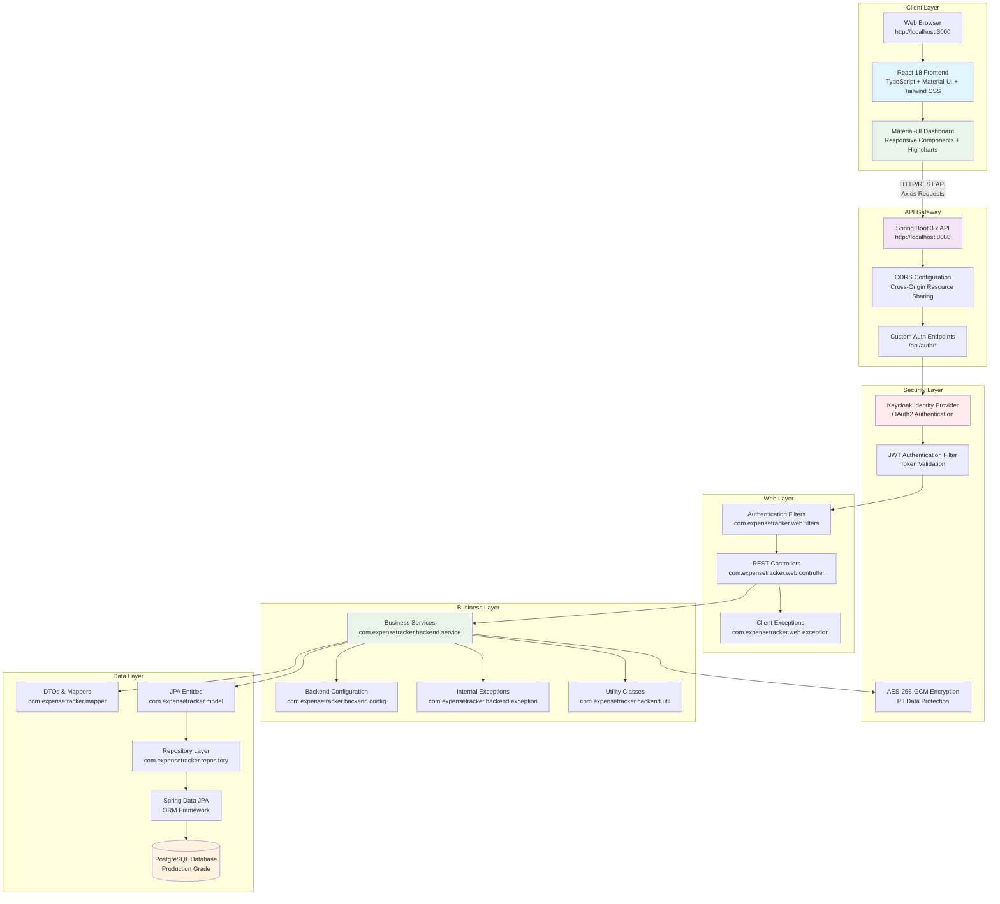
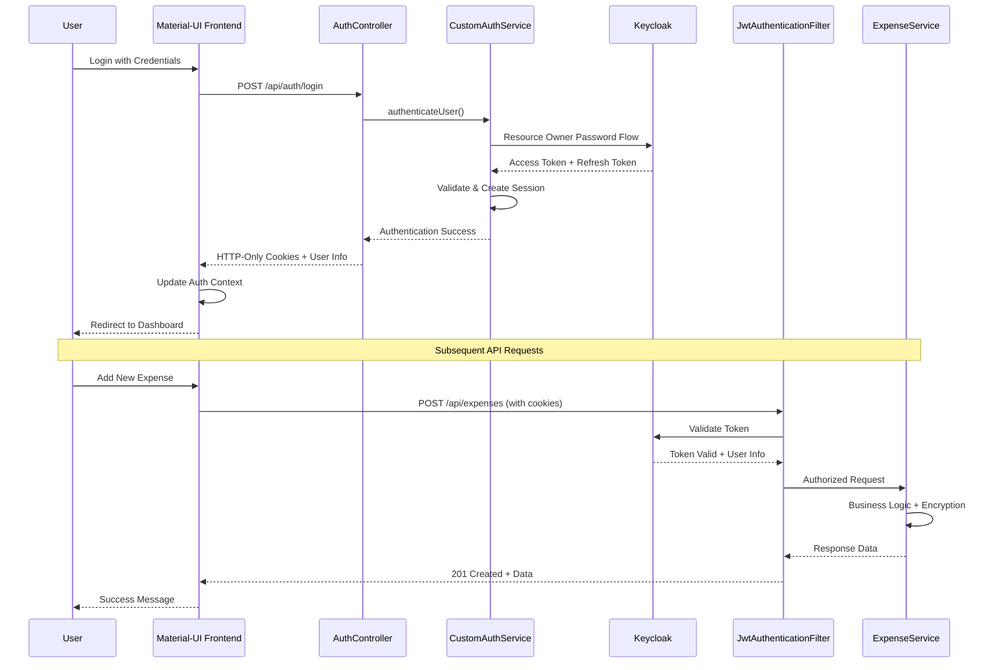
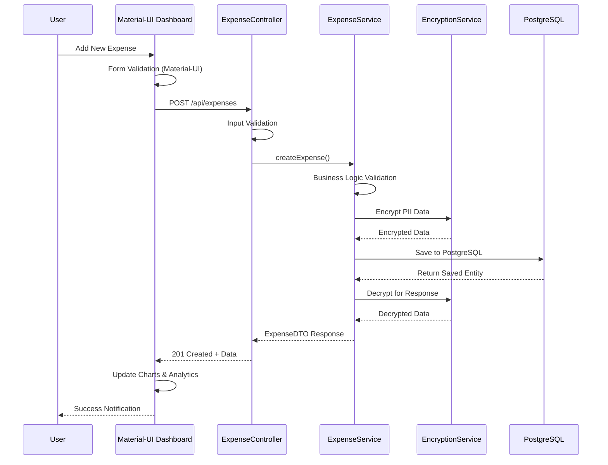
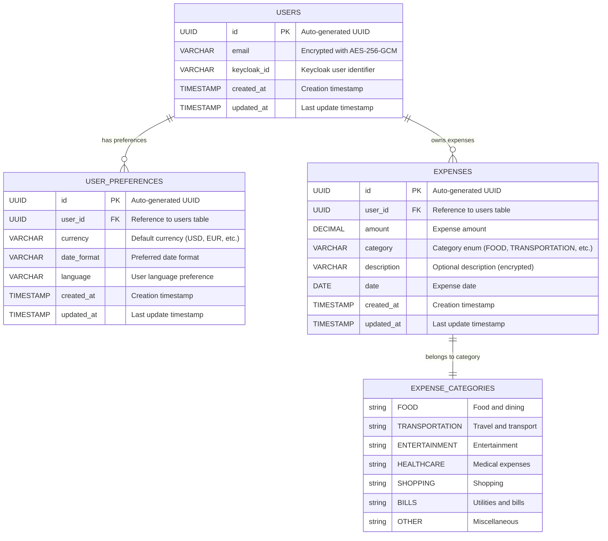
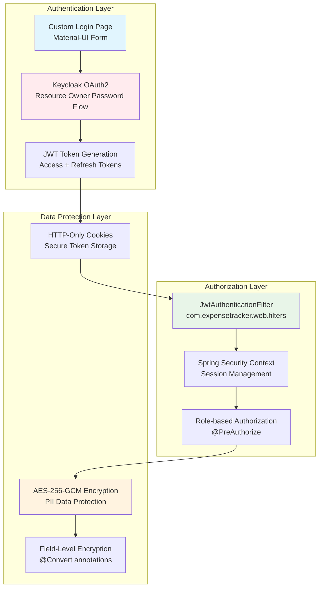
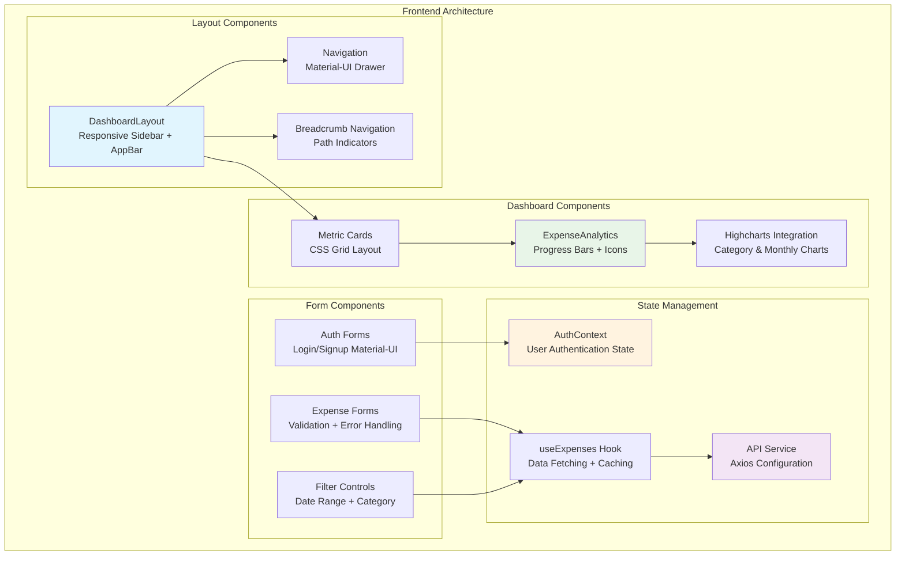

## 🏗️ Architecture Overview

### High-Level System Architecture



### Enterprise Package Structure

```mermaid
graph TB
    subgraph "com.expensetracker Package Structure"
        subgraph "main"
            APP[PersonalExpenseTrackerApplication<br/>@SpringBootApplication]
        end
        
        subgraph "backend - Business Logic Layer"
            B_CONFIG[config/<br/>Security, Data, Web Configuration]
            B_SERVICE[service/<br/>Business Logic & Processing]
            B_UTIL[util/<br/>Encryption & Utility Classes]
            B_EX[exception/<br/>Internal Server Errors (5xx)]
        end
        
        subgraph "web - Presentation Layer"
            W_CONTROLLER[controller/<br/>REST API Endpoints]
            W_FILTER[filters/<br/>JWT Authentication Filter]
            W_CONFIG[config/<br/>Security Handlers & Web Config]
            W_EX[exception/<br/>Client Errors (4xx)]
        end
        
        subgraph "mapper - Data Transfer"
            MAPPER[DTOs, Requests, Responses<br/>Data Transformation Layer]
        end
        
        subgraph "Shared Layers"
            MODEL[model/<br/>JPA Entities & Domain Objects]
            REPO[repository/<br/>Data Access Layer]
        end
    end
    
    APP --> B_CONFIG
    APP --> W_CONFIG
    W_CONTROLLER --> B_SERVICE
    W_FILTER --> B_SERVICE
    B_SERVICE --> MAPPER
    B_SERVICE --> MODEL
    B_SERVICE --> REPO
    W_CONTROLLER --> MAPPER
    W_CONTROLLER --> W_EX
    B_SERVICE --> B_EX
    B_SERVICE --> B_UTIL
    
    style APP fill:#e1f5fe
    style B_SERVICE fill:#e8f5e8
    style W_CONTROLLER fill:#fff3e0
    style MAPPER fill:#f3e5f5
    style MODEL fill:#ffebee
```

### OAuth2 Authentication Flow



### Component Interaction Flow



### Database Schema (PostgreSQL)



### Security Architecture



### Material-UI Dashboard Architecture



