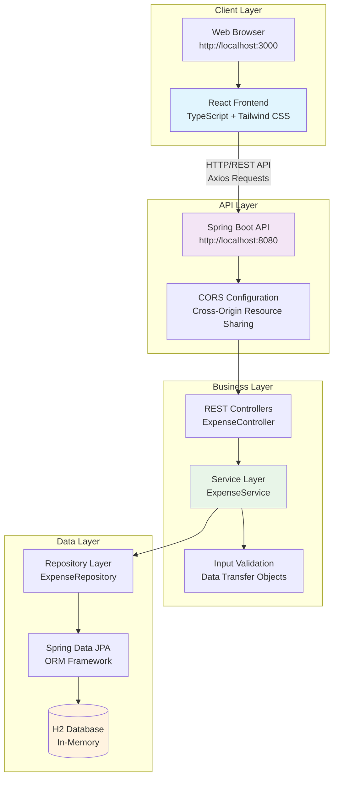
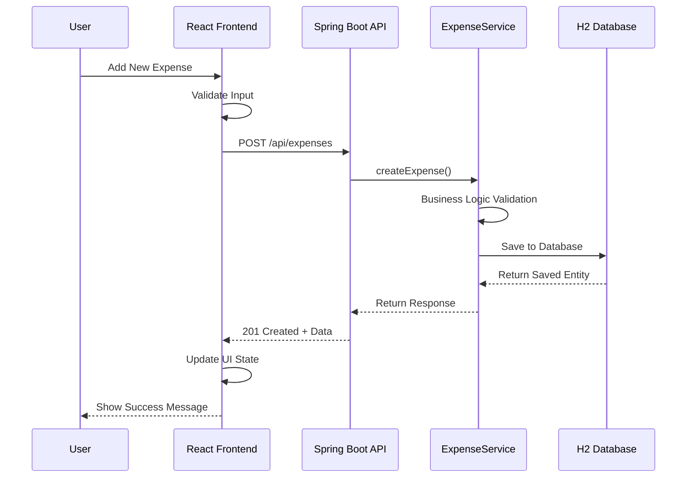
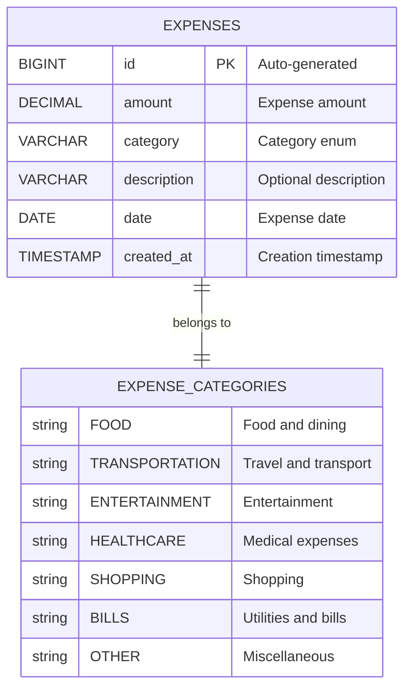

## 🏗️ Architecture Overview

### High-Level System Architecture

```mermaid
graph TB
    subgraph "Client Layer"
        UI[React Frontend<br/>TypeScript + Tailwind CSS]
        Browser[Web Browser<br/>http://localhost:3000]
    end
    
    subgraph "API Layer"
        Gateway[Spring Boot API<br/>http://localhost:8080]
        CORS[CORS Configuration<br/>Cross-Origin Resource Sharing]
    end
    
    subgraph "Business Layer"
        Controller[REST Controllers<br/>ExpenseController]
        Service[Service Layer<br/>ExpenseService]
        Validation[Input Validation<br/>Data Transfer Objects]
    end
    
    subgraph "Data Layer"
        Repository[Repository Layer<br/>ExpenseRepository]
        JPA[Spring Data JPA<br/>ORM Framework]
        Database[(H2 Database<br/>In-Memory)]
    end
    
    Browser --> UI
    UI --> |HTTP/REST API<br/>Axios Requests| Gateway
    Gateway --> CORS
    CORS --> Controller
    Controller --> Service
    Service --> Validation
    Service --> Repository
    Repository --> JPA
    JPA --> Database
    
    style UI fill:#e1f5fe
    style Gateway fill:#f3e5f5
    style Service fill:#e8f5e8
    style Database fill:#fff3e0
```

### Component Interaction Flow

```mermaid
sequenceDiagram
    participant User
    participant React as React Frontend
    participant API as Spring Boot API
    participant Service as ExpenseService
    participant DB as H2 Database
    
    User->>React: Add New Expense
    React->>React: Validate Input
    React->>API: POST /api/expenses
    API->>Service: createExpense()
    Service->>Service: Business Logic Validation
    Service->>DB: Save to Database
    DB-->>Service: Return Saved Entity
    Service-->>API: Return Response
    API-->>React: 201 Created + Data
    React->>React: Update UI State
    React-->>User: Show Success Message
```

### Database Schema

```mermaid
erDiagram
    EXPENSES {
        BIGINT id PK "Auto-generated"
        DECIMAL amount "Expense amount"
        VARCHAR category "Category enum"
        VARCHAR description "Optional description"
        DATE date "Expense date"
        TIMESTAMP created_at "Creation timestamp"
    }
    
    EXPENSE_CATEGORIES {
        string FOOD "Food and dining"
        string TRANSPORTATION "Travel and transport"
        string ENTERTAINMENT "Entertainment"
        string HEALTHCARE "Medical expenses"
        string SHOPPING "Shopping"
        string BILLS "Utilities and bills"
        string OTHER "Miscellaneous"
    }
    
    EXPENSES ||--|| EXPENSE_CATEGORIES : "belongs to"
```

